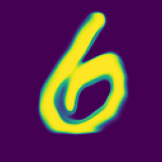

# GAN 範例（使用 MNIST）

## TL;DR quickstart

### Train

1. 啟動「train_gan」與「download_state」並關閉「load_state」。
2. **全部執行。**

### Test

1. 關閉「train_gan」與「download_state」，在「load_state」選擇預訓練權重來源：

    - From URL  
       從「load_state_from_url」指定的連結位址下載權重。
    - Upload  
       從本地端上傳權重檔。（需命名為 gan.pt）

2. **全部執行。**
3. 在最後的程式碼儲存格可以選擇要生成的數字與解析度，在執行後可以透過改變 dim 0~7 的數值來影響生成的字型。

## 特色

### 可控制

此範例透過 [Conditional GAN](https://arxiv.org/abs/1411.1784) 控制輸出的數字，並依靠 [InfoGAN](https://arxiv.org/abs/1606.03657) 讓 Latent Vector 能影響生成結果。

### 可變解析度

生成器並非像一般的 GAN 使用 MLP 或 CNN 直接將 Latent Vector 轉換為圖片，而是將 [Fourier Features Positional Encoding](https://bmild.github.io/fourfeat/index.html) 與 Latent Vector 串接後輸入至 MLP 以生成對應座標的像素值。利用此種做法，就能輕易增加或減少生成圖片的解析度。

## 生成結果

下圖是大小為 28、128、256 的生成結果，雖然在訓練過程中是使用 28x28 的圖片進行訓練，但這並不會成為對生成器輸出大小的限制。

